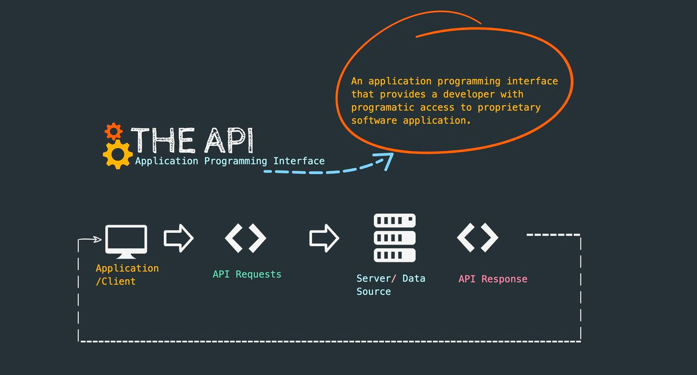

# 搭建php服务的openapi接口文档通过gitlab自动部署系统

### 前端后端交互流程


    前后端频繁通过接口对接 , 维护一个真实的api文档是非常有必要的, 但是这也是一个繁重的工作. 
    如果你是使用 php(hyperf) + gitlab(托管源码) , 那么此文适合你
    这是打造一套自动化文档系统部署的方案 (swagger-ui + openapi + php[hyperf] + nginx + gitlab-ci)

### hyperf增加配置
```shell
composer require --dev hyperf/swagger
php ./bin/hyperf.php gen:command SwaggerCommand
php ./bin/hyperf.php swagger:gen
```

### 搭建swagger-editor  (本地使用)

```shell
git clone https://github.com/swagger-api/swagger-editor;
cd swagger-editor
npm install
npm start
```

### 搭建swagger-ui  (可以部署到内网环境 , 没做账号密码保护 , 属于公开的!)


```shell
cd /www
git clone https://github.com/swagger-api/swagger-ui;
# 修改dist的读取的json配置的文件
sed -i 's#https://petstore.swagger.io/v2/swagger.json#openapi-doc.yaml#' dist/index.html
```
> nginx配置
```nginx
# 请替换对应的域名 swagger-ui.doc.com 和 路径 /www/swagger-ui
server {
    listen       80;
    server_name  swagger-ui.doc.com;
    error_page   500 502 503 504 /50x.html;
    root         /www/swagger-ui/dist;
    index        index.html index.htm;

    access_log   /data/nginx/swagger-ui/access_$logdate.log;
    error_log    /data/nginx/swagger-ui/error.log;

#    return 301 https://$server_name$request_uri;

    location / {
        charset  off;

        try_files $uri $uri/ /index.html;
    }

}

server {
    listen       443 ssl;
    server_name  swagger-ui;
    error_page   500 502 503 504 /50x.html;
    root         /www/swagger-ui/dist;
    index        index.html index.htm;

    access_log   /data/nginx/swagger-ui/access_$logdate.log;
    error_log    /data/nginx/swagger-ui/error.log;

    ssl_session_cache    shared:SSL:1m;
    ssl_certificate     pem/abc.com/cert.pem;  # pem文件的路径
    ssl_certificate_key  pem/abc.com/key.pem; # key文件的路径

    ssl_session_timeout  5m;    #缓存有效期
    ssl_ciphers ECDHE-RSA-AES128-GCM-SHA256:ECDHE:ECDH:AES:HIGH:!NULL:!aNULL:!MD5:!ADH:!RC4;    #加密算法
    ssl_protocols TLSv1 TLSv1.1 TLSv1.2;    #安全链接可选的加密协议
    ssl_prefer_server_ciphers on;   #使用服务器端的首选算法

    location / {
        charset  off;

        try_files $uri $uri/ /index.html;
    }

}
```

### 配置gitlab自动打包文档到项目


> 配置gitlab-ci.yml
```yaml
# 这个例子是当test分支有任何提交 , 会自动生成openapi-doc.yaml , 并复制到 /www/dist/openapi-doc.yaml
# $SWAGGER_API_JSON_FILE_NAME 生成的api的文件名字 , 如: openapi-doc.yaml
# $SWAGGER_ROOT_DIST_PATH swagger-ui的dist所在目录, 如: /www/dist/
stages:
  - buildApi
build_test_api:
  stage: buildApi
  script:
    - |
      echo "git checkout ${CI_COMMIT_REF_NAME} --";
      git checkout ${CI_COMMIT_REF_NAME} --
      git pull
      if [[ "$WEB_ROOT_PATH" == "" ]]; then
        echo "EMPTY VAR WEB_ROOT_PATH";
      else
        composer install
        php ./bin/hyperf.php swagger:gen
        cp $SWAGGER_API_JSON_FILE_NAME $SWAGGER_ROOT_DIST_PATH
      fi
  only:
    - test
  tags:
    - build
```

### 如何在hyperf框架下配好一个swagger文档基本信息(新增一个文件app/Utils/SwaggerUtil.php)
```php
<?php

declare(strict_types=1);
/**
 * This file is part of mydomain.
 * 这个例子支持传递一个token=?的检验参数作为账号识别
 *
 * @link     https://mydomain.com
 * @document https://doc.mydomain.com
 * @contact  it@mydomain.com
 */
namespace App\Utils;

use OpenApi\Annotations as OA;

/**
 * 文档生成器注解.
 *
 * @OA\Info(title="mydomain", version="0.1")
 * @OA\Server(url="https://api.mydomain.com", description="正式环境(慎用)[https]")
 * @OA\Server(url="http://127.0.0.1:9601", description="开发环境(本地)")
 * @OA\SecurityScheme(
 *     securityScheme="tpToken",
 *     type="apiKey",
 *     in="query",
 *     name="token"
 * )
 * @OA\Schema(
 *     schema="ApiSuccessResponse",
 *     type="object",
 *     description="{""code"": 200,""data"": {},""msg"": """",""time"": 1624432870}",
 *     properties={
 *         @OA\Property(
 *             type="integer",
 *             property="code",
 *             description="code",
 *             example="200"
 *         ),
 *         @OA\Property(
 *             type="object",
 *             property="data",
 *             description="data",
 *             example="{}"
 *         ),
 *         @OA\Property(
 *             type="string",
 *             property="msg",
 *             description="msg",
 *             example=""
 *         ),
 *         @OA\Property(
 *             type="integer",
 *             property="time",
 *             description="current timestamp",
 *             example="1624500732"
 *         )
 *     }
 * )
 * @OA\Schema(
 *     schema="ApiFaile500Response",
 *     type="object",
 *     description="{""code"": 0,""data"": {},""msg"": ""???"",""time"": 1624432870}",
 *     properties={
 *         @OA\Property(
 *             type="integer",
 *             property="code",
 *             description="code",
 *             example="500"
 *         ),
 *         @OA\Property(
 *             type="object",
 *             property="data",
 *             description="data",
 *             example="{}"
 *         ),
 *         @OA\Property(
 *             type="string",
 *             property="msg",
 *             description="msg",
 *             example="Illegal string offset '?'"
 *         ),
 *         @OA\Property(
 *             type="integer",
 *             property="time",
 *             description="current timestamp",
 *             example="1624500732"
 *         )
 *     }
 * )
 */
class SwaggerUtil
{
}
```


### 如何写一个文档注释
```php
/**
 * 
 * @OA\Get(
 *      path="/users",
 *      operationId="getListOfUsers",
 *      tags={"Users"},
 *      description="Get list of users",
 *      security={{"Authorization-Bearer":{}}}, 
 *      @OA\Parameter(
 *         name="Authorization",
 *         in="header",
 *         required=true,
 *         description="Bearer {access-token}",
 *         @OA\Schema(
 *              type="bearerAuth"
 *         ) 
 *      ), 
 *      @OA\Response(
 *          response=200,
 *          description="Get list of users.",
 *          @OA\JsonContent(type="object",
 *              @OA\Property(property="message", type="string"),
 *              @OA\Property(property="data", type="array",
 *                  @OA\Items(type="object",
 *                      @OA\Property(property="id", type="integer"),
 *                      @OA\Property(property="name", type="string"),
 *                      @OA\Property(property="email", type="string"),
 *                  ),
 *              ),
 *          ),
 *       ),
 *       @OA\Response(response=401, description="Unauthorized"),
 *       @OA\Response(response=404, description="Not Found"),
 * )
 * 
 *
 *
 * @OA\Post(
 *      path="/api/login",
 *      tags={"手机验证码登录"},
 *      summary="手机验证码登录",
 *      description="用户登录（手机号+验证码）",
 *
 *      @OA\Parameter(ref="#/components/parameters/authToken"),//这里引入了authToken参数
 *      @OA\RequestBody( 
 *          @OA\MediaType(
 *              *mediaType="application/json",
 *              mediaType="application/x-www-form-urlencoded",
 *              @OA\Schema(ref="#/components/schemas/MobileLogin") //这里引入了手机验证码登录属性模板
 *          )
 *      ),
 *      @OA\Response(
 *          response=200,
 *          description="successful operation",
 *          @OA\JsonContent(
 *              ref="#/components/schemas/MsgExport",//这里引入了公共响应模板
 *              example={"code":0,"reason":"接口响应消息","result":{"status":1},"params":{}},
 *          )
 *       ),
 *
 * )
 * 如果有多个参数的话且复用度较高，可以独立设置params，然后引用 
 * @OA\Parameter(
 *     in="header",
 *     name="authToken",
 *     description="测试HeaderToken",
 *     required=true,
 *     @OA\Schema(
 *          type="string"
 *     )
 * ),
 */
```

> 官方文档: [https://swagger.io/specification/](https://swagger.io/specification/)
>
> 中文文档: [https://www.sdk.cn/details/9pPQD6wqK09L8ozvNy#title-5](https://www.sdk.cn/details/9pPQD6wqK09L8ozvNy#title-5)


### postman导出openapi文档的工具
[https://apitransform.com/convert/](https://apitransform.com/convert/)

